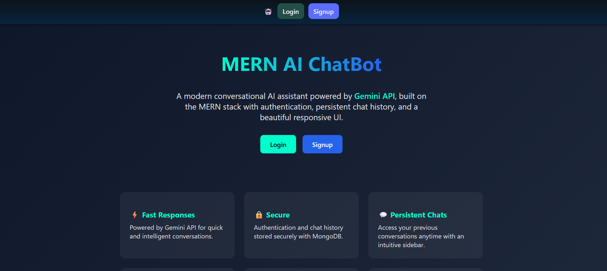

# MERN AI Chat Interface

<p align="center">
  
</p>

A full-stack AI SaaS chat platform built with the **MERN stack** and integrated with **Google’s Gemini API**.
The app allows users to securely sign up, log in, and interact with an AI assistant in persistent chat sessions.

---
## Demo  

Try out the live chatbot here:  

Link: **[MERN AI Chat Interface | Live on Render](https://mern-ai-chatbot-frontend-0cb0.onrender.com/)**  

🔒 **Note:** Your credentials are completely secure. Passwords are hashed using the `bcrypt` library before being stored in the database, ensuring they are never visible to the developer.  

---

## Features

* **User Authentication**

  * Secure sign-up and login using **JWT** (JSON Web Tokens).
  * Tokens stored in **HTTP-only cookies** for enhanced security.
  * Session persistence for **7 days**.

* **AI Chatbot**

  * Integrated with **Google Gemini API** to generate conversational responses.
  * Maintains full conversation history per user chat.
  * Optimistic UI updates for smooth, real-time experience.

* **Chat Management**

  * Create, delete, and switch between multiple chat sessions.
  * Each chat stores all prior messages (user + AI).

* **Modern UI**

  * Built with **React + TypeScript**.
  * Fully responsive and mobile-friendly.
  * Sidebar for managing conversations.

* **Backend APIs**

  * Built with **Node.js + Express**.
  * RESTful APIs for authentication and chat management.
  * Data stored in **MongoDB**.

---

## 🛠 Tech Stack

**Frontend:**

* React (TypeScript)
* Context API (auth/session state)
* Axios for API requests
* React Router for navigation
* React Hot Toast for notifications
* Lucide-React icons

**Backend:**

* Node.js + Express
* MongoDB + Mongoose
* Google Gemini API
* JWT authentication
* Bcrypt for password hashing
* Cookie-Parser for secure cookies
* CORS configuration
* Postman for dev

**Deployment:**

* Render (Frontend + Backend)
* Environment variables managed via Render Dashboard

---

## Installation & Setup

### 1. Clone the repository

```bash
git clone https://github.com/lishaangral/MERN-AI-ChatBot.git
cd MERN-AI-ChatBot
```

### 2. Setup the backend

```bash
cd backend
npm install
```

Create a `.env` file in `/backend`:

```env
PORT=5000
MONGO_URI=your_mongodb_connection_string
JWT_SECRET=your_jwt_secret
COOKIE_SECRET=your_cookie_secret
CORS_ORIGIN=http://localhost:5173
GEMINI_API_KEY=your_google_gemini_api_key
```

Start backend in dev mode:

```bash
npm run dev
```

### 3. Setup the frontend

```bash
cd frontend
npm install
```

Create a `.env` file in `/frontend`:

```env
VITE_API_BASE_URL=http://localhost:5000/api/v1
VITE_API_USE_CREDENTIALS=true
```

Start frontend:

```bash
npm run dev
```

Now open [http://localhost:5173](http://localhost:5173) on your local machine.

---

## Deployment (Render)

### Backend:

1. Create a new **Web Service** in Render.
2. Connect GitHub repo → `/backend` directory.
3. Add environment variables (`MONGO_URI`, `JWT_SECRET`, `COOKIE_SECRET`, `CORS_ORIGIN`, `GEMINI_API_KEY`).
4. Build Command:

   ```bash
   npm install && npm run build
   ```

   Start Command:

   ```bash
   npm start
   ```

### Frontend:

1. Create a new **Static Site** in Render.

2. Connect GitHub repo → `/frontend` directory.

3. Add environment variables:

   ```env
   VITE_API_BASE_URL=https://<your-backend-service>.onrender.com/api/v1
   VITE_API_USE_CREDENTIALS=true
   ```

4. Build Command:

   ```bash
   npm install && npm run build
   ```

   Publish Directory:

   ```
   dist
   ```

5. Add **Redirect & Rewrite rule** for SPA:

   * Source: `/*`
   * Destination: `/index.html`
   * Type: Rewrite (200)

---

## 📂 Project Structure

```
MERN-AI-ChatBot/
│
├── backend/
│   ├── src/
│   │   ├── controllers/   # Auth & chat controllers
│   │   ├── models/        # Mongoose schemas (User, Chat)
│   │   ├── routes/        # Express routes
│   │   ├── utils/         # JWT, validators
│   │   ├── config/        # Gemini API setup
│   │   └── app.ts         # Express app config
│   └── package.json
│
├── frontend/
│   ├── src/
│   │   ├── components/    # Sidebar, PromptForm, etc.
│   │   ├── context/       # AuthProvider
│   │   ├── helpers/       # Axios API communicator
│   │   ├── pages/         # Home, Chat, Login, Signup
│   │   ├── App.tsx
│   │   └── main.tsx
│   └── package.json
│
└── README.md
```

---

## Key Learnings

* Integrating Google Gemini API in a MERN application.
* Secure user authentication with JWT + cookies + React Context.
* Managing SPA routes in deployment (Render + React Router).
* Optimistic UI updates for chat applications.
* CORS handling between frontend and backend.

---

## Future Improvements

* Add support for file uploads (e.g., images or docs).
* Enhance chat UI with markdown rendering.
* Add role-based access and admin dashboard.
* Enable dark/light mode toggle.

---

## Author/Developer

**Lisha Angral**

* GitHub: [@lishaangral](https://github.com/lishaangral)
